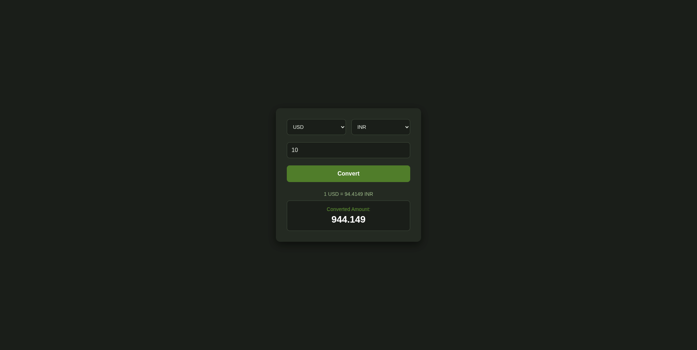

# Currency Converter

A simple web application that converts currencies using real-time exchange rates. Users can select source and target currencies, enter an amount, and instantly view the converted value along with the current exchange rate.

## Features

- Real-time currency conversion
- Supports multiple international currencies
- Displays current exchange rate
- Simple and responsive interface
- Error handling for failed API requests

## Tech Stack

- HTML
- CSS
- JavaScript
- ExchangeRate API

## Project Structure

```text
Currency-Converter/
├── Images
├── README.md
├── index.html
└── style.css
```

## Running Locally

1. Clone the repository

```bash
git clone <repository-url>
```

2. Open the project folder

```bash
cd Currency-Converter
```

3. Open `index.html` in your browser.

## Running Tests

No automated tests are configured for this project.

## Integration Notes

This project is fully client-side and can be integrated into larger applications by embedding the conversion interface or reusing the API integration logic.

## Screenshots

### Home Page



## Additional Resources

- ExchangeRate API Documentation: https://www.exchangerate-api.com/
